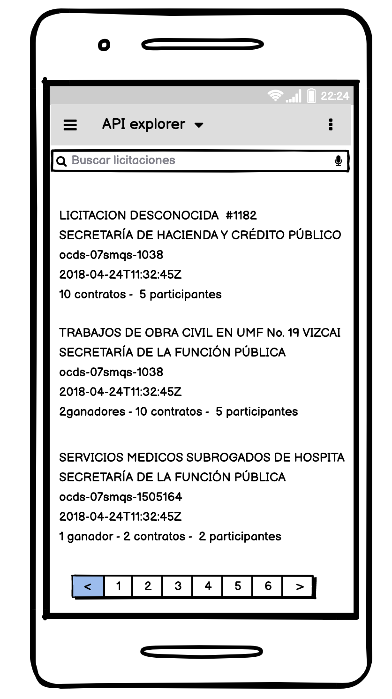
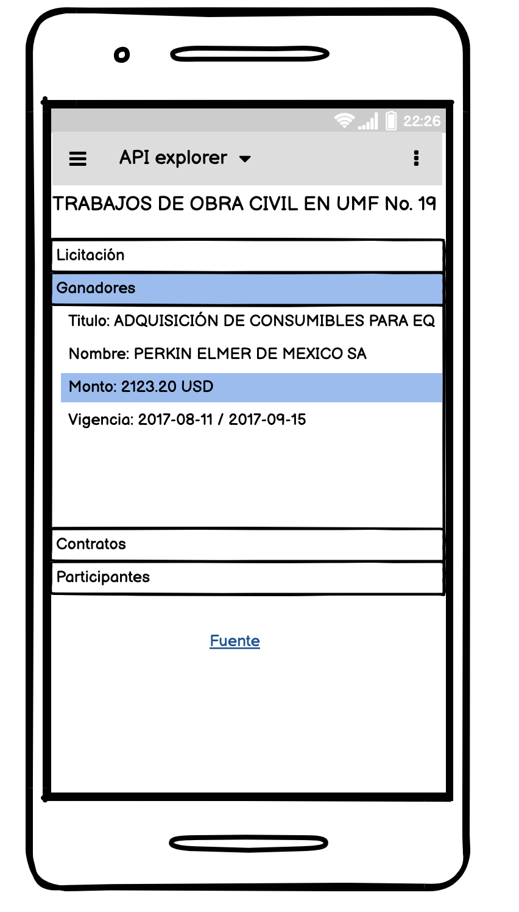

# React Native Tech Test

## [Video demostración](https://youtu.be/VlLN3EWO3nI)
## Welcome!

This README provides the instructions to a small, self-contained test for a Software Engineer position
(React Native flavor)

## What we're looking for
We're looking for a talented and driven developer, comfortable with building high quality solutions.

# 🚀 Intro
This is a quick coding challenge we designed to assess your qualifications as a potential  developer. It's important to note that this is by no means a test. We just want to get a sense of how you write code and solve problems.

## The Challenge
We'll be looking for **simple, well-designed and tested(extra points)** code in the submission.

Please include a ``INSTRUCTIONS.md``:
- Setup instructions
- Are there any improvements you could make to your submission

## The app
Use the [Open Data API from Mexico's Government Contracts](https://api.datos.gob.mx/v2/Records/) and create a project based on the following wireframe. **extra points if you build a more attractive UI**

### Contracts List

- List all the  available contracts in the first page of the API. You can chose how many items, and wich page want to display using the `page` and `pageSize` arguments while consuming the API.

Each contract must be a card component (or similar) wich shows the following information:
- Tender title (if not present, use the id)
- Contract Publisher
- Contract Id
- Date of publication
- number fo winners, available contracts and participants (`awards, contracts, parties`)  

Aditional requirements:
- You must display a pagination component in the bottom of the page.
- Clicking on the card, shows the **Contract Detail** on master/detail pattern

### Contract Detail

- Details of the contract in an accordion component or similar (tender, winners, contractracts, parties...)
- Button to the source of the contract

## Required
- React Native

## Deliverables
We expect your repo URL, using **the technology that you decide, of those mentioned in "required"**. Due to this, we ask that you also provide a `INSTRUCTIONS.md` with instructions for running your project, and also add in the repo:

- Signed APK to run your solution in an android device or expo link to test your solution in iOS
- A 45 seconds video tour of you explaining how did you solve the challenge

If you come across any questions or anything we didn't cover on this README, feel free to reach out to us and we'll get you an answer as soon as possible.
If you have any question please contact HR
Happy coding!
